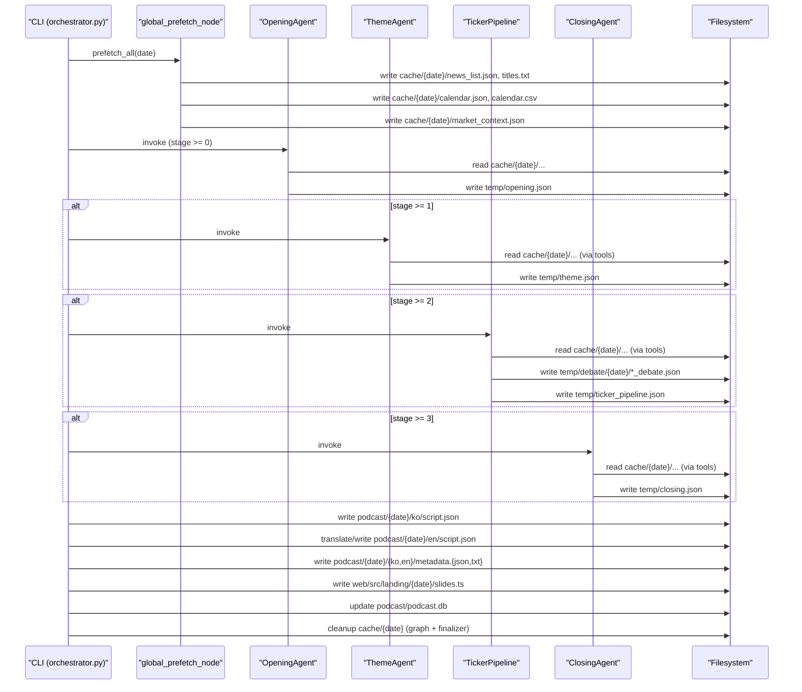
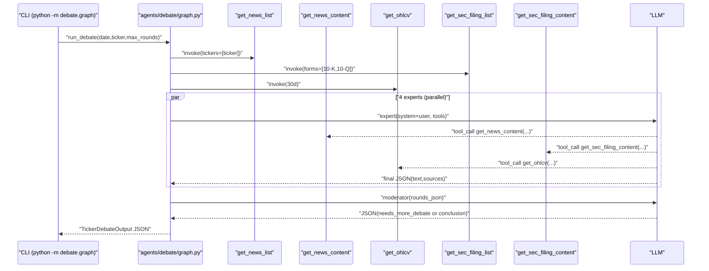

# 미국 주식 장마감 AI 브리핑 서비스

http://43.201.213.158/
<br>
Team: `지피티야 팀명 추천해줘`

이 레포는 “장마감 브리핑 스크립트 생성 → TTS 오디오 생성 → S3/RSS/CloudFront 기반 팟캐스트 배포 → YouTube 영상 렌더/업로드”까지의 파이프라인과, 그 입력이 되는 뉴스 데이터 수집용 AWS Lambda를 포함합니다.
또한, 생성된 산출물을 재생/탐색하기 위한 Next.js 웹 플레이어(`web/`)를 포함합니다.

## 아키텍처 한눈에 보기

```mermaid
flowchart TD
  classDef ghost fill:#fff,stroke:#bbb,stroke-dasharray:3 3,color:#777;

  subgraph AWS["AWS: 뉴스 수집/저장"]
    direction LR
    AWS_EB["EventBridge Scheduler (30m)"] --> AWS_LAMBDA["Lambda (container)"]
    AWS_LAMBDA --> AWS_UPLOAD["upload_db: list crawl → DynamoDB (idempotent)"]
    AWS_LAMBDA --> AWS_DETAIL["detail_crawl: page crawl → S3(XML) + DynamoDB update"]
    AWS_UPLOAD --> AWS_DDB["DynamoDB: NEWS_TABLE"]
    AWS_DETAIL --> AWS_S3["S3: NEWS_BUCKET (article XML)"]
    AWS_DETAIL --> AWS_DDB
  end

  subgraph ENTRY["Entry + Prefetch (한 번만)"]
    direction LR
    IN["입력<br/>date(YYYYMMDD) + user_tickers(optional)"] --> ORCH["orchestrator.py<br/>LangGraph(StateGraph)"]
    ORCH --> PF["global_prefetch_node<br/>prefetch_all(date) → cache/{date}/...<br/>news_list.json, titles.txt, bodies/*<br/>calendar.csv, calendar.json<br/>market_context.json"]
  end

  PF --> OA

  subgraph AGENTS["Agents (스크립트 생성)"]
    direction LR
    OA["OpeningAgent"] --> TA["ThemeAgent"] --> CO["CompanyAgent<br/>(TickerPipeline: ticker별 분석 + 대본 생성)"] --> CA["ClosingAgent"]

    subgraph OAD["OpeningAgent 내부"]
      direction LR
      OA_LC["load_context_node"] --> OA_PM["prepare_initial_messages"] --> OA_A["agent (ReAct)"]
      OA_A -->|tool_calls| OA_T["ToolNode(TOOLS)"]
      OA_T --> OA_A
      OA_A -->|final| OA_EX["extract_script_node<br/>themes + nutshell + opening scripts"]
    end

    subgraph TAD["ThemeAgent 내부 (Fan-out / Fan-in)"]
      direction LR
      TA_LB["load_base_from_temp"] --> TA0["Fan-out: run_theme_workers<br/>batch(..., return_exceptions=True)"]

      subgraph TWPAR["ThemeWorkerGraph 병렬 실행 (테마별)"]
        direction LR

        subgraph W1["Worker#1 (theme[0])"]
          direction LR
          W1LC["load_context_node"] --> W1P["prepare_messages_node"] --> W1A["worker_agent_node (ReAct)"]
          W1A -->|tool_calls| W1T["ToolNode(TOOLS)"]
          W1T --> W1A
          W1A -->|final| W1E["extract_theme_scripts_node"]
        end

        subgraph W2["Worker#2 (theme[1])"]
          direction LR
          W2LC["load_context_node"] --> W2P["prepare_messages_node"] --> W2A["worker_agent_node (ReAct)"]
          W2A -->|tool_calls| W2T["ToolNode(TOOLS)"]
          W2T --> W2A
          W2A -->|final| W2E["extract_theme_scripts_node"]
        end

        subgraph W3["Worker#3 (theme[2])"]
          direction LR
          W3LC["load_context_node"] --> W3P["prepare_messages_node"] --> W3A["worker_agent_node (ReAct)"]
          W3A -->|tool_calls| W3T["ToolNode(TOOLS)"]
          W3T --> W3A
          W3A -->|final| W3E["extract_theme_scripts_node"]
        end

        WN["... Worker#N"]:::ghost
      end

      TA0 --> W1
      TA0 --> W2
      TA0 --> W3
      TA0 --> WN

      W1 --> TA1["Fan-in: merge_scripts<br/>opening + theme scripts"]
      W2 --> TA1
      W3 --> TA1
      WN --> TA1

      TA1 --> TA2["refine_transitions<br/>edits only"]
    end

    subgraph COD["CompanyAgent 내부 (Fan-out / Debate / Fan-in)"]
      direction LR
      CO0["Fan-out: tickers[]<br/>사용자 입력 ticker별 병렬 실행"]

      subgraph COPAR["CompanyWorker 병렬 실행 (ticker별)"]
        direction LR

        subgraph C1W["CompanyWorker#1 (ticker[0])"]
          direction LR
          C1LC["load_context<br/>news list + chart(30d 1d + today 5m) + SEC index"] --> C1R1["Round 1: Blind Analysis<br/>4 Persona 병렬"]
          C1R1 --> C1DEB["Rounds 2-N: Guided Debate<br/>Moderator 진행 (멀티턴)"]
          C1DEB --> C1CONS["Final Conclusion<br/>Consensus(action+confidence) + 근거 정리"]
          C1CONS --> C1SCR["Ticker Script Worker<br/>(tool-less, 6~8 turns)"]

          subgraph C1P["4 Expert Personas"]
            direction LR
            C1P1["Fundamental"]
            C1P2["Risk Manager"]
            C1P3["Growth Analyst"]
            C1P4["Sentiment"]
          end

          C1R1 --> C1P1
          C1R1 --> C1P2
          C1R1 --> C1P3
          C1R1 --> C1P4
          C1P1 --> C1DEB
          C1P2 --> C1DEB
          C1P3 --> C1DEB
          C1P4 --> C1DEB

          C1TOOLS["Tool calls (as needed)<br/>뉴스/차트/SEC 등 근거 조회"]:::ghost
          C1DEB -.-> C1TOOLS
        end

        subgraph C2W["CompanyWorker#2 (ticker[1])"]
          direction LR
          C2LC["load_context"] --> C2R1["Round 1: Blind Analysis"] --> C2DEB["Rounds 2-N: Guided Debate"] --> C2CONS["Final Conclusion"] --> C2SCR["Ticker Script Worker"]
        end

        subgraph C3W["CompanyWorker#3 (ticker[2])"]
          direction LR
          C3LC["load_context"] --> C3R1["Round 1: Blind Analysis"] --> C3DEB["Rounds 2-N: Guided Debate"] --> C3CONS["Final Conclusion"] --> C3SCR["Ticker Script Worker"]
        end

        CNW["... CompanyWorker#N"]:::ghost
      end

      CO0 --> C1W
      CO0 --> C2W
      CO0 --> C3W
      CO0 --> CNW

      C1SCR --> CO_M["Fan-in: merge_company_scripts<br/>기업별 파트 합치기 + id 정규화"]
      C2SCR --> CO_M
      C3SCR --> CO_M
      CNW --> CO_M

      CO_M --> CO_REF["ticker_script_refiner<br/>(tool-less, 전환부 다듬기)"]
      CO_REF --> CO_O["scripts[]에 append<br/>theme 뒤에 ticker 챕터 추가"]
    end

    subgraph CAD["ClosingAgent 내부"]
      direction LR
      CA_LS["load_scripts_from_temp"] --> CA_LC["load_context_node"] --> CA_PM["prepare_messages_node"] --> CA_A["agent (ReAct)"]
      CA_A -->|tool_calls| CA_T["ToolNode(TOOLS)<br/>get_calendar/get_ohlcv"]
      CA_T --> CA_A
      CA_A -->|final| CA_EX["extract_closing_turns_node"]
      CA_EX --> CA_APP["append_scripts_node"]
    end

    PF -.-> OA_LC
    PF -.-> W1LC
    PF -.-> CO0
    PF -.-> CA_LC

    OA --> OA_LC
    OA_EX --> TA

    TA --> TA_LB
    TA2 --> CO

    CO --> CO0
    CO_O --> CA

    CA --> CA_LS
  end

  subgraph ARTIFACTS["Artifacts"]
    direction LR
    TEMP_OPEN["temp/opening.json"] --> TEMP_THEME["temp/theme.json"] --> TEMP_TICKER["temp/ticker_pipeline.json"] --> TEMP_CLOSE["temp/closing.json"]
    TEMP_DEB["temp/debate/{date}/{TICKER}_debate.json<br/>(ticker별 Debate 산출물)"]
    POD["podcast/{date}/{ko,en}/script.json<br/>(date/nutshell/user_tickers/chapter/scripts)"]
    DB1["podcast/podcast.db 업데이트<br/>upsert_script_row(...)"]
  end

  OA_EX --> TEMP_OPEN
  TA2 --> TEMP_THEME
  CO_O --> TEMP_TICKER
  CA_APP --> TEMP_CLOSE
  CO0 --> TEMP_DEB

  ORCH --> POD
  ORCH --> DB1

  subgraph TTS["TTS (script.json 생성 후 실행)"]
    direction LR
    POD --> TT0["python -m tts.src.tts --lang ko|en<br/>(LangGraph)"]

    subgraph TTG["TTS Graph (turn-level)"]
      direction LR
      TT_CFG["load_config<br/>gemini_tts*.yaml 로드/검증"] --> TT_V["validate_paths<br/>script.json 존재 확인"] --> TT_LS["load_script<br/>podcast/{date}/{lang}/script.json 로드"]
      TT_LS --> TT_MAP["map_turns_with_chapter<br/>speaker→label + chapter 범위 적용"] --> TT_REQ["build_turn_requests<br/>instructions + text → prompt"]
      TT_REQ --> TF["generate_turn_audio_parallel<br/>turn별 TTS 병렬 생성(배치)"]

      subgraph TPAR["병렬 TTS 호출 (turn별)"]
        direction LR
        T0["turn#0 TTS → 000.wav"]
        T1["turn#1 TTS → 001.wav"]
        T2n["turn#2 TTS → 002.wav"]
        Tn["... turn#N TTS → NNN.wav"]:::ghost
      end

      TF --> T0
      TF --> T1
      TF --> T2n
      TF --> Tn

      T0 --> TT_TIM["compute_timeline<br/>프레임 기반 start/end(ms) 계산"]
      T1 --> TT_TIM
      T2n --> TT_TIM
      Tn --> TT_TIM

      TT_TIM --> TT_MERGE["merge_audio<br/>{date}.wav 생성"] --> TT_OUT["write_outputs<br/>timeline.json + {date}.json 저장 + DB 업데이트"]
    end

    TT0 --> TT_CFG
    TT_YAML["tts/config/gemini_tts*.yaml"] --> TT_CFG

    GEM["Gemini TTS API<br/>GEMINI_API_KEY"]
    T0 -.-> GEM
    T1 -.-> GEM
    T2n -.-> GEM
    Tn -.-> GEM
  end

  subgraph TTS_OUT["TTS Outputs"]
    direction LR
    WAV["podcast/{date}/{lang}/{date}.wav"]
    MP3["podcast/{date}/{lang}/{date}.mp3"]
    TURNS["podcast/{date}/{lang}/tts/<turn>.wav"]
    TL["podcast/{date}/{lang}/tts/timeline.json"]
    DATEJSON["podcast/{date}/{lang}/{date}.json<br/>scripts[].time 주입"]
    DB2["podcast/podcast.db 업데이트<br/>update_tts_row(tts_done=true)"]
  end

  TT_OUT --> WAV
  TT_OUT --> MP3
  TT_OUT --> TURNS
  TT_OUT --> TL
  TT_OUT --> DATEJSON
  TT_OUT --> DB2

  subgraph WEB["Web Frontend (Next.js)"]
    direction LR
    WEB_BUILD["npm run build:data<br/>(web/scripts/build-data.ts)"] --> WEB_PUB["web/public/{data,audio}"] --> WEB_APP["Next.js app (web/)"]
  end
  DB1 --> WEB_BUILD
  MP3 --> WEB_BUILD
  DATEJSON --> WEB_BUILD

  subgraph DIST["Distribution"]
    direction LR
    S3UP["run_daily.sh Step 4<br/>S3 upload: podcast-daily-stock/{date}/{lang}/..."]
    RSS["AWS/scripts/update_podcast_feed.py<br/>podcast.xml / podcast_en.xml"]
    CF["CloudFront<br/>RSS + episode media delivery"]
    YT["youtube_pipeline.yml<br/>Remotion MP4 + YouTube upload"]
  end
  MP3 --> S3UP
  DATEJSON --> YT
  S3UP --> RSS --> CF

  %% Data dependencies
  AWS_DDB -. "prefetch_all/news" .-> PF
  AWS_S3 -. "get_news_content (tools)" .-> OA_T
```



### Orchestrator 캐시/산출물 시퀀스



### Debate 실행 시퀀스 (per ticker)



## 실행 (Quick Start)

### 0) 설정 파일

- **비밀키(API Key)**: `.env`에만 저장(권장)
  - 예: `OPENAI_API_KEY`, `GEMINI_API_KEY`, `LANGSMITH_API_KEY`
- **비밀이 아닌 런타임 설정(모델/timeout/라운드/AWS 등)**: `config/app.yaml`로 관리(권장)
  - 로딩 우선순위: (shell export) > (`config/app.yaml`) > (`.env`, `override=False`)

시작:
1. `.env.example` → `.env` 복사 후 API 키 채우기
2. 필요하면 `config/app.yaml` 수정

### 1) 장마감 브리핑 스크립트 생성 (Opening → Theme → Ticker → Closing)

```bash
uv run orchestrator.py 20251222 -t GOOG AAPL
```

- 결과:
  - `podcast/20251222/ko/script.json`
  - `podcast/20251222/en/script.json`
  - `podcast/20251222/{ko,en}/metadata.json`
  - `web/src/landing/20251222/slides.ts`
- 참고: orchestrator는 실행 중 `cache/20251222/`를 만들고 종료 시 정리합니다(디버깅용 산출물은 `temp/`와 `podcast/`에 남음).

### 2) TTS 실행 (turn 단위 오디오 생성 + 합본 + MP3 변환)

```bash
uv run python -m tts.src.tts 20251222 --lang ko
uv run python -m tts.src.tts 20251222 --lang en
```

- 입력: `podcast/20251222/{ko,en}/script.json`
- 출력:
  - `podcast/20251222/{ko,en}/tts/*.wav` (turn별)
  - `podcast/20251222/{ko,en}/tts/timeline.json`
  - `podcast/20251222/{ko,en}/20251222.wav` (합본 WAV, 원본)
  - `podcast/20251222/{ko,en}/20251222.mp3` (합본 MP3, 배포용)
  - `podcast/20251222/{ko,en}/20251222.json` (time 주입된 최종 스크립트)

### 2.5) 메타데이터 생성 (Spotify/팟캐스트 플랫폼용)

```bash
uv run python web/scripts/generate-podcast-metadata.py 20251222 ko
uv run python AWS/translation/translate_metadata.py 20251222
```

- 입력:
  - `podcast/20251222/ko/script.json`
  - `podcast/20251222/ko/metadata.json` (영어 메타데이터 번역 시)
- 출력:
  - `podcast/20251222/ko/metadata.json` (title, description, keywords)
  - `podcast/20251222/ko/metadata.txt` (복사-붙여넣기용)
  - `podcast/20251222/en/metadata.json`
  - `podcast/20251222/en/metadata.txt`
- 특징:
  - title은 nutshell에서 자동 생성
  - description은 LLM으로 생성 (YAML 프롬프트 기반)
  - keywords는 script에서 자동 추출 (티커, 회사명 등)

### 3) Web 플레이어 실행 (Next.js)

```bash
cd web
npm install

# DB에서 데이터 빌드 + 개발 서버 실행
npm run dev:fresh
```

- 접속: `http://localhost:3000`
- 참고: `podcast/podcast.db`가 갱신된 뒤에는 `npm run build:data`가 필요합니다.

## GitHub Actions 자동화

워크플로 정의: `.github/workflows/daily_podcast.yml`, `.github/workflows/youtube_pipeline.yml`

두 워크플로 모두 `workflow_dispatch`로 수동 실행합니다. `date`를 비워두면 GitHub Actions 러너에서 `America/New_York` 기준 오늘 날짜(`YYYYMMDD`)로 변환하고, 실행 중 필요한 민감 정보는 GitHub Secrets/Variables에서만 주입합니다(키 값이나 OAuth 파일 원문은 저장소와 README에 기록하지 않음).

### Daily Stock Podcast Automation

기준 스크립트: `run_daily.sh` (Actions에서는 Step 1/2를 분리 실행한 뒤 남은 단계를 이 스크립트로 재개)

입력:
- `date`: 실행 날짜(`YYYYMMDD`, 비우면 뉴욕 기준 오늘)
- `tickers`: 선택 티커(공백/쉼표 구분, 비우면 Theme 이후 자동 선택)
- `start_from`: 일일 파이프라인 재시작 단계(`1`~`6`)

실행 흐름:
1. Checkout 후 `uv`, Python 3.13, `ffmpeg`, AWS CLI를 준비합니다.
2. 뉴스 수집용 AWS 프로필과 S3 업로드용 `.env`를 Actions 런타임에서만 구성합니다.
3. `start_from=1`이면 Step 1을 워크플로에서 직접 실행합니다.
   - `uv run orchestrator.py "$TARGET_DATE" [-t TICKER ...]`
   - 수동 티커가 없으면 Theme 생성 후 theme-distinct large-cap mover를 자동 선택합니다.
4. Step 1 산출물을 현재 브랜치에 커밋/푸시합니다.
   - 주요 경로: `podcast/`, `web/public/audio/`, `web/src/landing/{date}/`, `web/src/generated/shorts-firm/`
5. `start_from=1` 또는 `2`이면 Step 2(Korean TTS + Shorts + Shorts-Firm)를 워크플로에서 재시도 루프로 실행하고, 배포에 필요한 파일만 남긴 뒤 커밋/푸시합니다.
6. 남은 단계는 `run_daily.sh`로 이어서 실행합니다.
   - `start_from=1` 또는 `2`로 시작한 경우 `./run_daily.sh "$TARGET_DATE" ... --start-from 3`
   - `start_from=3`~`6`으로 시작한 경우 해당 단계부터 재개
7. `run_daily.sh`의 Step 3~6에서 English TTS, S3 업로드, RSS 갱신, 중간 파일 정리를 수행합니다.
8. 최종 `podcast/{date}`를 GitHub Actions artifact로 업로드하고, 생성/갱신된 산출물을 현재 브랜치에 커밋/푸시합니다.

### YouTube Automation

엔트리포인트: `run_youtube.sh` + `run_youtube_episode_remotion.sh`

입력:
- `date`: 실행 날짜(`YYYYMMDD`, 비우면 뉴욕 기준 오늘)
- `lang`: `ko` 또는 `en`
- `start_from`: YouTube 쇼츠 워크플로 재시작 단계(`1`=assets, `2`=render, `3`=upload)
- `overwrite`: 기존 렌더 산출물 덮어쓰기 여부
- `upload`: YouTube 업로드 여부
- `privacy`: `public`, `unlisted`, `private`
- `preview_seconds`: 일부 구간만 빠르게 렌더링
- `remotion_only`: 쇼츠 파이프라인을 건너뛰고 풀 에피소드 Remotion 렌더만 실행

실행 흐름:
1. Checkout 후 `uv`, Python 3.13, Node.js 20, `ffmpeg`, Playwright Chromium, web 의존성을 준비합니다.
2. `upload=true`이면 Actions 런타임에서만 YouTube OAuth 파일을 복원합니다.
3. 쇼츠 파이프라인은 `run_youtube.sh`를 렌더 중심으로 호출합니다.
   - `start_from=1` → `./run_youtube.sh "$TARGET_DATE" --lang "$LANG" --start-from 1 --stop-after 2 --no-upload`
   - `start_from=2` → `./run_youtube.sh "$TARGET_DATE" --lang "$LANG" --start-from 2 --stop-after 2 --no-upload`
   - `start_from=3` → 기존 MP4를 사용해 워크플로의 별도 업로드 단계부터 진행
4. 워크플로가 쇼츠 3종(`shorts`, `shorts-firm`, `shorts-theme-firm`)을 각각 업로드합니다.
   - `privacy=public`일 때 `shorts-firm`, `shorts-theme-firm`은 지연 공개 예약으로 업로드합니다.
5. `podcast-video-llm`은 `run_youtube.sh --start-from 4 --stop-after 4 --no-upload`으로 렌더한 뒤 별도 단계에서 업로드합니다.
6. 쇼츠/`podcast-video-llm` 산출물을 GitHub Actions artifact로 업로드하고, 필요한 MP4/썸네일/웹 public 데이터/렌더 메타데이터를 현재 브랜치에 커밋/푸시합니다.
7. `upload=true` 또는 `remotion_only=true`이면 `run_youtube_episode_remotion.sh`로 풀 에피소드 영상을 렌더합니다.
8. `upload=true`이면 에피소드 썸네일을 생성하고 풀 에피소드 영상을 YouTube에 업로드합니다.

## 자동화 산출물과 배포 흐름

### 1) 스크립트/번역/메타데이터

`orchestrator.py`는 한국어 스크립트를 만든 뒤 영어 스크립트와 플랫폼용 메타데이터까지 이어서 생성합니다.

```text
podcast/{date}/ko/script.json
        ↓ AWS/translation/translate.py
podcast/{date}/en/script.json

podcast/{date}/ko/metadata.json
podcast/{date}/ko/metadata.txt
        ↓ AWS/translation/translate_metadata.py
podcast/{date}/en/metadata.json
podcast/{date}/en/metadata.txt
```

- 한국어 스크립트 저장 후 `podcast/podcast.db`에 `script_saved_at`, `nutshell`, `user_tickers`가 갱신됩니다.
- 웹 랜딩 슬라이드는 `web/scripts/slide_generator.py`가 `web/src/landing/{date}/slides.ts`를 만들고 `web/src/landing/index.ts`를 갱신합니다.
- 메타데이터 JSON은 S3/RSS/YouTube 업로드 제목·설명·키워드의 기준 데이터로 사용됩니다.

### 2) TTS 오디오 생성

`tts/src/tts.py`는 언어별 `script.json`을 읽고 turn 단위 WAV를 병렬 생성한 뒤 합본 WAV/MP3와 타임라인 JSON을 저장합니다.

```text
podcast/{date}/{lang}/script.json
        ↓ python -m tts.src.tts {date} --lang ko|en
podcast/{date}/{lang}/tts/*.wav
podcast/{date}/{lang}/tts/timeline.json
podcast/{date}/{lang}/{date}.wav
podcast/{date}/{lang}/{date}.mp3
podcast/{date}/{lang}/{date}.json
```

- `{date}.json`은 원본 스크립트에 `scripts[*].time=[start_ms,end_ms]`를 주입한 파일입니다.
- 완료 시 `podcast/podcast.db`의 `tts_done=true`, `final_saved_at`이 갱신됩니다.
- `run_daily.sh`는 Step 2에서 한국어 TTS와 쇼츠용 오디오/슬라이드를 만들고, Step 3에서 영어 TTS를 만듭니다.

### 3) AWS/S3 팟캐스트 배포

`run_daily.sh` Step 4는 배포용 MP3, 메타데이터, 썸네일을 S3 버킷의 날짜/언어별 경로로 업로드합니다.

```text
podcast-daily-stock/
  {date}/
    ko/
      {date}.mp3
      metadata.json
      thumbnail.png
      shorts/shorts{date}.mp3          # 있으면 업로드
      shorts-firm/shorts{date}.mp3     # Step 4 조건에 맞는 파일이 있으면 업로드
    en/
      {date}.mp3
      metadata.json
      thumbnail.png
```

- 썸네일은 `shared/ops/scripts/youtube/generate_episode_thumbnail.sh`가 Next.js 썸네일 라우트를 띄워 캡처합니다.
- S3 업로드 단계는 뉴스 수집용 AWS 프로필과 분리해, Actions 런타임 또는 로컬 `.env`의 S3 배포용 AWS 설정을 사용합니다.
- `run_daily.sh` Step 5는 `AWS/scripts/update_podcast_feed.py --lang ko`와 `--lang en`을 실행합니다.
- RSS 생성 스크립트는 S3의 날짜 폴더를 스캔하고, 각 언어의 `metadata.json`, MP3 크기/길이, 썸네일 존재 여부를 읽어 `AWS/podcast.xml`, `AWS/podcast_en.xml`을 만든 뒤 S3 루트에 업로드합니다.
- `rss_index_ko.json`, `rss_index_en.json`은 S3 객체 변경 여부와 길이 계산 결과를 캐시해 RSS 갱신 비용을 줄입니다.

팟캐스트 플랫폼 배포는 플랫폼 API에 MP3를 직접 올리는 방식이 아니라, S3에 올라간 RSS XML을 CloudFront URL로 노출하는 방식입니다. Spotify/Apple Podcasts 같은 클라이언트는 RSS의 `<enclosure>` URL을 통해 `https://{CLOUDFRONT_DOMAIN}/{date}/{lang}/{date}.mp3` 형식의 오디오를 가져갑니다.

### 4) YouTube 영상 생성/업로드

YouTube 자동화는 `.github/workflows/youtube_pipeline.yml`에서 실행되며, 로컬 기준 핵심 스크립트는 `run_youtube.sh`와 `run_youtube_episode_remotion.sh`입니다.

```text
podcast/{date}/{lang}/{date}.json
podcast/{date}/{lang}/{date}.mp3
podcast/{date}/{lang}/metadata.json
        ↓
podcast/{date}/{lang}/shorts/youtube/{date}_{lang}_shorts.mp4
podcast/{date}/{lang}/shorts-firm/youtube/{date}_{lang}_shorts.mp4
podcast/{date}/{lang}/shorts-theme-firm/youtube/{date}_{lang}_shorts.mp4
podcast/{date}/{lang}/podcast-video-llm/youtube/{date}_{lang}_podcast_video_llm.mp4
podcast/{date}/{lang}/youtube-remotion/{date}_{lang}_episode_remotion.mp4
```

- `run_youtube.sh` Step 1은 쇼츠 3종의 스크립트/오디오/슬라이드 렌더 JSON을 준비합니다.
- Step 2는 Remotion으로 쇼츠 3종 MP4를 만들고 첫 프레임 썸네일을 생성합니다.
- Step 4는 `podcast-video-llm/run_podcast_video_llm.sh`를 호출해 별도 긴 영상 MP4와 썸네일을 만듭니다.
- 풀 에피소드 영상은 `run_youtube_episode_remotion.sh`가 episode JSON/MP3를 `web/public`에 동기화하고, 차트 데이터를 미리 받아 Remotion MP4를 렌더합니다.
- 업로드는 `shared/ops/scripts/youtube/upload_youtube_video.py`가 담당합니다. 이 스크립트는 `metadata.json`과 episode JSON의 챕터 타임라인으로 제목/설명/태그/챕터를 구성하고, OAuth 토큰 파일은 런타임 경로에서만 읽습니다.
- GitHub Actions에서는 쇼츠 3종, `podcast-video-llm`, 풀 에피소드를 각각 검증 후 업로드하며, 생성된 MP4/썸네일/웹 public 데이터/렌더 메타데이터를 artifact와 브랜치 커밋으로 남깁니다.

## 스크립트 파이프라인 상세

상위 오케스트레이터: `orchestrator.py` (문서: `ORCHESTRATOR.md`)

### 단계 구성

- **global_prefetch**
  - `cache/{date}/news_list.json`, `calendar.csv`, `market_context.json` 등을 미리 생성
- **OpeningAgent** (`agents/opening/graph.py`)
  - `nutshell`(한 줄 요약), `themes`(테마 후보), 오프닝 대본 생성 → `temp/opening.json`
- **ThemeAgent** (`agents/theme/graph.py`)
  - 테마별 Worker 병렬 실행(fan-out) → 병합(fan-in) → 전환 Refiner → `temp/theme.json`
- **TickerPipeline** (`orchestrator.py:ticker_pipeline_node`)
  - 사용자 티커(`-t/--tickers`) 기준
  - fan-out: 티커별 Debate → `temp/debate/{date}/{TICKER}_debate.json`
  - fan-out: 티커별 Script Worker(tool-less) → fan-in merge → Refiner(tool-less) → `temp/ticker_pipeline.json`
- **ClosingAgent** (`agents/closing/graph.py`)
  - 누적 대본 입력으로 마무리 파트 생성 → `temp/closing.json`

### 최종 산출물(`podcast/{date}/{lang}/script.json`) 구조(요약)

```json
{
  "date": "20251222",
  "nutshell": "string",
  "user_tickers": ["GOOG"],
  "chapter": [
    { "name": "opening", "start_id": 0, "end_id": 5 },
    { "name": "theme", "start_id": 6, "end_id": 25 },
    { "name": "ticker", "start_id": 26, "end_id": 40 },
    { "name": "closing", "start_id": 41, "end_id": 45 }
  ],
  "scripts": [
    { "id": 0, "speaker": "진행자", "text": "…", "sources": [] }
  ]
}
```

## TTS 파이프라인 상세

엔트리포인트: `tts/src/tts.py` (문서: `tts/ARCHITECTURE.md`)

- 입력: `podcast/{date}/{lang}/script.json`
- 설정:
  - `tts/config/gemini_tts.yaml` (Korean)
  - `tts/config/gemini_tts_en.yaml` (English)
  - speaker별 instruction/voice/timeout/병렬도 등
- 필수 환경변수: `GEMINI_API_KEY`

## AWS Lambda (뉴스 수집 파이프라인)

문서: `LAMBDA.md`, 코드: `Lambda/`, 이미지: `Lambda.Dockerfile`

- 트리거: EventBridge 스케줄러 `kubig-LambdaTrigger` (약 30분 주기)
- 기능:
  - Yahoo Finance Latest News(US) 크롤링 → DynamoDB에 메타데이터 적재(멱등)
  - 상세 기사 크롤링 → XML 직렬화 후 S3 저장 → DynamoDB에 `path/publish_et_iso/provider/related_articles` 업데이트
- 환경변수(대표):
  - `TABLE_NAME` (DynamoDB)
  - `BUCKET_NAME` (S3)
  - `AWS_REGION`

이 Lambda가 채운 DynamoDB/S3 데이터는 스크립트 파이프라인의 뉴스 툴(`shared/tools/news.py`) 및 프리페치(`shared/fetchers/news.py`)에서 사용됩니다.

## Web Frontend

문서: `WEB.md`, 코드: `web/`

### Quick Start

```bash
cd web

# 의존성 설치
npm install

# DB에서 데이터 빌드 + 개발 서버 실행
npm run dev:fresh

# 또는 개발 서버만 실행 (기존 데이터 사용)
npm run dev
```

### Scripts

| 명령어 | 설명 |
|--------|------|
| `npm run dev` | 개발 서버 실행 (localhost만) |
| `npm run dev:network` | 개발 서버 실행 (외부 네트워크 접근 허용, `내IP:3000`) |
| `npm run dev:fresh` | 데이터 빌드 + 개발 서버 |
| `npm run build:data` | DB → public/ 데이터 빌드만 |
| `npm run build` | 데이터 빌드 + 프로덕션 빌드 |
| `npm run start` | 프로덕션 서버 실행 |

### 데이터 흐름

```
../podcast/podcast.db             # SQLite DB (에피소드 메타데이터)
../podcast/{date}/ko/{date}.json  # 웹 기본 에피소드 스크립트/타임라인
../podcast/{date}/ko/{date}.mp3   # 웹 기본 에피소드 오디오
        ↓
  npm run build:data (scripts/build-data.ts)
        ↓
public/data/episodes.json         # 에피소드 목록
public/data/{date}.json           # 에피소드 상세 데이터
public/audio/{date}.mp3           # 오디오 파일
```

## 주요 디렉토리

```text
agents/            # Opening/Theme/Closing (+ Debate는 agents/debate)
debate/            # Debate/Types wrapper + ticker_script 파이프라인(티커 대본)
shared/            # tools/fetchers/config/utils (공용)
config/            # app.yaml (비밀 아닌 런타임 설정)
podcast/           # 최종 산출물 + DB
  ├── {date}/
  │   ├── ko/
  │   │   ├── script.json       # TTS 입력용 한국어 스크립트
  │   │   ├── {date}.json       # time 주입 최종 스크립트
  │   │   ├── {date}.wav        # 최종 병합 오디오 (WAV)
  │   │   ├── {date}.mp3        # 최종 병합 오디오 (MP3, 배포용)
  │   │   ├── metadata.json     # 팟캐스트/YouTube 메타데이터
  │   │   ├── metadata.txt
  │   │   ├── tts/              # 턴별 오디오 파일 + timeline.json
  │   │   ├── shorts*/          # 쇼츠 스크립트/오디오/렌더 산출물
  │   │   ├── podcast-video-llm/
  │   │   ├── youtube/          # 썸네일/브라우저 캡처형 영상
  │   │   └── youtube-remotion/ # 풀 에피소드 Remotion 영상
  │   └── en/                   # 영어 스크립트/TTS/메타데이터/영상 산출물
  └── podcast.db              # 에피소드 인덱스
tts/               # TTS 파이프라인
Lambda/            # 뉴스 수집 AWS Lambda
AWS/               # S3/RSS/번역 스크립트 + podcast.xml
web/               # Next.js 웹 플레이어
  ├── src/landing/{date}/
  │   └── slides.ts           # 웹 슬라이드 (자동 생성)
  └── scripts/                # 빌드/생성 스크립트
      ├── prompts/
      │   └── metadata.yaml   # 메타데이터 생성 프롬프트
      ├── build-data.ts       # DB → public/ 데이터 변환
      ├── slide_generator.py  # 슬라이드 생성 모듈
      ├── generate-slides.py  # 슬라이드 생성 CLI
      └── generate-podcast-metadata.py  # 메타데이터 생성 CLI
```

## 참고 문서

- `ORCHESTRATOR.md`
- `agents/opening/ARCHITECTURE.md`
- `agents/theme/ARCHITECTURE.md`
- `agents/closing/ARCHITECTURE.md`
- `debate/ARCHITECTURE.md`
- `podcast/ARCHITECTURE.md`
- `tts/ARCHITECTURE.md`
- `LAMBDA.md`
- `WEB.md`
