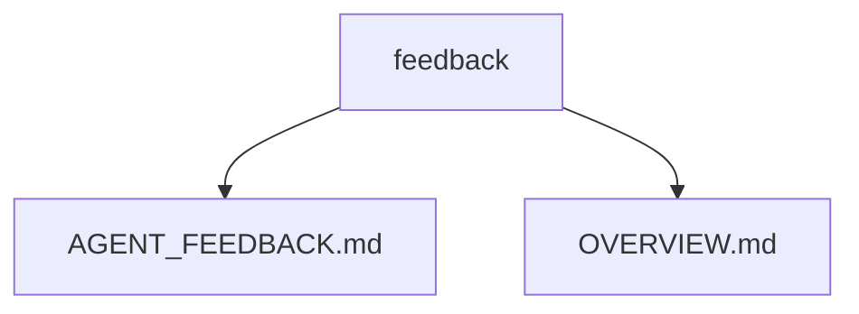

# feedback

## Overview
- TODO: Describe this folder's role and boundaries.

## Key Responsibilities
- TODO: Add 2-4 bullets for what belongs in this folder.

## Notes
- Keep this file concise and update when folder responsibilities change.

<!-- AUTO-GENERATED:START -->
## Recent Updates (auto)

- Generated (UTC): 2026-02-14 21:51:16Z
- Compared against: `HEAD`
- Folder: `feedback`
- Significant changes: 1 file(s)

### Structure Summary
- `AGENT_FEEDBACK.md`
- `OVERVIEW.md`

### Structure Diagram (auto)

### Change Hotspots
- AGENT_FEEDBACK.md: 1 file(s)

### Important Diff Summary
- `AGENT_FEEDBACK.md`: new file (documentation)
<!-- AUTO-GENERATED:END -->
