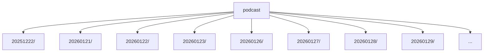

# Podcast 산출물 폴더 (`podcast/`)

`podcast/`는 브리핑 파이프라인의 **최종 산출물 저장소**입니다.

- Orchestrator(Agents)가 `podcast/{date}/script.json`을 생성합니다. (TTS 입력)
- TTS 파이프라인이 오디오 및 타임라인을 생성합니다.
- `podcast/podcast.db`는 날짜별 산출물을 빠르게 조회/서빙하기 위한 인덱스 DB입니다.

---

## 디렉토리 구조

```text
podcast/
  podcast.db                   # 날짜별 인덱스(SQLite)

  {YYYYMMDD}/                  # 날짜별 최신 산출물 디렉토리
    script.json                # 오케스트레이터 결과(=TTS 입력)
    {YYYYMMDD}.wav             # 최종 합본 오디오(TTS 출력)
    {YYYYMMDD}.json            # script.json + scripts[*].time 주입(TTS 출력)
    tts/
      00.wav, 01.wav, ...      # turn별 wav(TTS 출력)
      timeline.json            # turn 타임라인 + gap + final_wav 경로(TTS 출력)

  legacy_{YYYYMMDD}/           # 레거시 산출물(선택, 마이그레이션/비교용)
    script.json
    {YYYYMMDD}.wav
    {YYYYMMDD}.json
    tts/
      timeline.json
```

> `cache/{date}/`는 실행 중 생성되는 공유 캐시이며, 종료 시 삭제됩니다. `podcast/`는 보존되는 산출물입니다.

---

## 주요 파일 설명

### `podcast/{date}/script.json`

- Producer: `orchestrator.py`
- Consumer: `tts/src/tts.py`
- 포함 정보(요약):
  - `date`, `nutshell`, `user_tickers`
  - `chapter[]`: opening/theme/ticker/closing 챕터 범위
  - `scripts[]`: `{id, speaker, text, sources...}`

### `podcast/{date}/tts/timeline.json`

turn별 오디오 파일(`tts/*.wav`)을 시간축으로 배치하기 위한 메타데이터입니다.

- `turns[*].start_time_ms/end_time_ms`: 최종 합본에서의 위치
- `gaps`: turn 사이 무음 간격(기본/챕터 경계)
- `final_wav`: `../{date}.wav` 형태의 상대 경로

### `podcast/{date}/{date}.json`

`script.json`을 기반으로 `scripts[*].time=[start_ms,end_ms]` 필드를 주입한 파일입니다.

- Producer: `tts/src/nodes.py::write_outputs_node`
- 활용: 웹/플레이어에서 turn 하이라이트, 자막 싱크 등에 사용 가능

---

## 인덱스 DB: `podcast/podcast.db`

### 목적

- 날짜별 최신 산출물 목록을 빠르게 조회(웹 서버/서빙용)
- “대본 저장 여부”와 “TTS 완료 여부”를 추적

### 스키마 (요약)

`podcast_db.py::_ensure_schema()`에서 생성합니다.

| 컬럼 | 타입 | 의미 |
|---|---|---|
| `date` | TEXT (PK) | YYYYMMDD |
| `nutshell` | TEXT | 한 줄 요약 |
| `user_tickers` | TEXT(JSON) | 사용자 티커 리스트(JSON 문자열) |
| `script_saved_at` | TEXT | script.json 저장 시각(UTC ISO) |
| `tts_done` | BOOLEAN | TTS 완료 여부 |
| `final_saved_at` | TEXT | 최종 WAV 저장 시각(UTC ISO) |

### 업데이트 주체

- Orchestrator: `podcast_db.upsert_script_row(...)`
  - `nutshell`, `user_tickers`, `script_saved_at` 갱신
- TTS: `podcast_db.update_tts_row(...)`
  - `tts_done=true`, `final_saved_at` 갱신(필요 시 `nutshell/user_tickers/script_saved_at`도 함께)

---

## 보통의 실행 흐름

1) Orchestrator 실행 → `podcast/{date}/script.json` 생성
2) TTS 실행 → `podcast/{date}/tts/*.wav`, `timeline.json`, `{date}.wav`, `{date}.json` 생성
3) `podcast/podcast.db`에서 해당 날짜 행이 `tts_done=true`로 갱신

<!-- AUTO-GENERATED:START -->
## Recent Updates (auto)

- Generated (UTC): 2026-02-14 08:53:29Z
- Compared against: `HEAD`
- Folder: `podcast`

### Logic Summary
- Stores date-partitioned artifacts using `YYYYMMDD` directory layout.
- Maintains local SQLite state (`podcast.db`) for generated episode metadata.
- Current changes are concentrated in: ARCHITECTURE.md, podcast.db-shm, podcast.db-wal.

### Structure Diagram (auto)


### Change Hotspots
- ARCHITECTURE.md: 1 file(s)
- podcast.db-shm: 1 file(s)
- podcast.db-wal: 1 file(s)

### Recent File Samples
- `ARCHITECTURE.md`
- `podcast.db-shm`
- `podcast.db-wal`
<!-- AUTO-GENERATED:END -->

