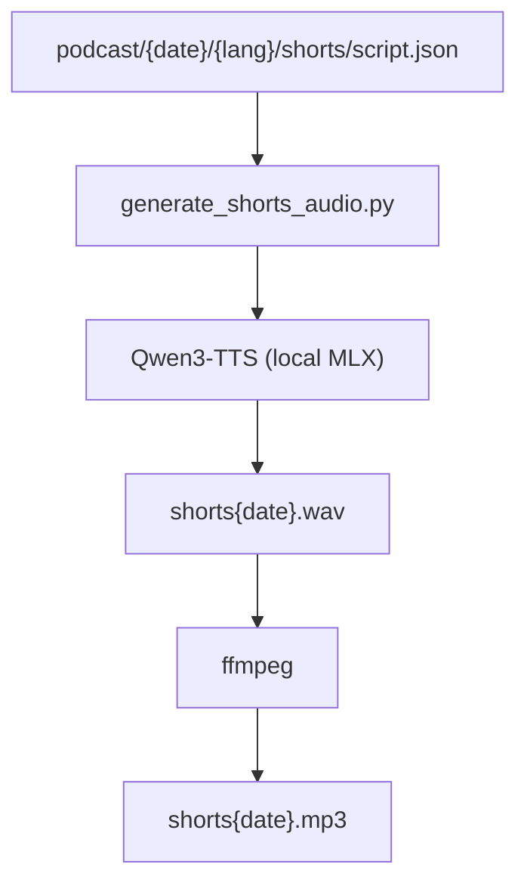

# shorts

## Logic Summary
- `generate_shorts.py` builds short-form script content from daily podcast outputs.
- `generate_shorts_audio.py` converts shorts text to local Qwen3-TTS WAV, then converts to MP3.
- Output contract is fixed at `podcast/{date}/{lang}/shorts/shorts{date}.wav|mp3`.

## Structure Diagram

## Change Hotspots
- TTS provider was switched from Gemini API to local Qwen3-TTS.
- Existing retry/split/merge logic and WAV->MP3 conversion flow were preserved.
- `--voice` remains as CLI input, interpreted as Qwen voice/style hint.
