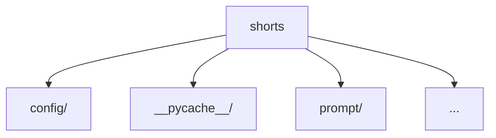

# shorts

## Overview
- TODO: Describe this folder's role and boundaries.

## Core Logic
- TODO: Describe input -> processing -> output flow.

## Structure Notes
- TODO: Explain key subfolders/files and ownership boundaries.

<!-- AUTO-GENERATED:START -->
## Recent Updates (auto)

- Generated (UTC): 2026-02-14 08:56:31Z
- Compared against: `HEAD`
- Folder: `shorts`

### Logic Summary
- Module appears organized around: config, __pycache__, prompt.
- Track architecture and behavior changes in this folder-level document.

### Structure Diagram (auto)

### Change Hotspots
- No changes detected

### Recent File Samples
- No changed files
<!-- AUTO-GENERATED:END -->
