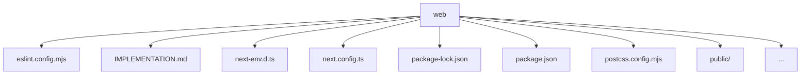

# 웹사이트 구현 계획

## 개요

미국 증시 팟캐스트 웹 플레이어 구현. Figma 디자인 기반, Next.js + TypeScript + Tailwind CSS 사용.

**서빙 방식**: Static Export (SSG)

---

## 데이터 구조

### 1. 데이터 소스

웹에서 필요한 데이터는 **두 가지**만:

```
podcast/
├── podcast.db              # 에피소드 목록 (메인 페이지)
└── {YYYYMMDD}/
    ├── {YYYYMMDD}.json     # 에피소드 상세 (스크립트 + 타임라인)
    ├── {YYYYMMDD}.wav      # 오디오 파일 (WAV)
    ├── {YYYYMMDD}.mp3      # 오디오 파일 (MP3, 배포용)
    ├── metadata.json       # 팟캐스트 메타데이터 (title, description, keywords)
    └── metadata.txt        # 메타데이터 (Spotify 업로드용)
```

> `tts/` 디렉토리는 웹에서 접근 불필요. `{YYYYMMDD}.json`에 모든 타임라인 정보 포함.
> `metadata.json/txt`는 팟캐스트 플랫폼 업로드용으로 생성됨 (`web/scripts/generate-podcast-metadata.py`).

### 2. podcast.db 스키마

| 컬럼 | 타입 | 설명 |
|------|------|------|
| `date` | TEXT (PK) | YYYYMMDD |
| `nutshell` | TEXT | 한 줄 요약 (에피소드 제목) |
| `user_tickers` | TEXT (JSON) | 관련 종목 티커 배열 `["LLY", "MSFT"]` |
| `tts_done` | BOOLEAN | TTS 완료 여부 (true인 것만 표시) |

### 3. {YYYYMMDD}.json 구조

```typescript
interface Episode {
  date: string;                    // "20251222"
  nutshell: string;                // "AI 랠리와 금 폭주, 위험과 안전이 동시에 달린 날"
  user_tickers: string[];          // ["LLY"]
  chapter: Chapter[];
  scripts: Script[];
}

interface Chapter {
  name: "opening" | "theme" | "ticker" | "closing";
  start_id: number;
  end_id: number;
}

interface Script {
  id: number;
  speaker: "진행자" | "해설자";
  text: string;
  sources: Source[];
  time: [number, number];          // [start_ms, end_ms] ← 플레이어 싱크에 사용
}

interface Source {
  type: "chart" | "article" | "event" | "sec_filing";
  ticker?: string;
  start_date?: string;
  end_date?: string;
  pk?: string;
  title?: string;
  id?: string;
  date?: string;
  form?: string;
  filed_date?: string;
  accession_number?: string;
}
```

---

## Static Export 구조

빌드 시 `podcast/` 데이터를 `web/public/`으로 복사/변환:

```
web/public/
├── data/
│   ├── episodes.json         # podcast.db → JSON (목록)
│   └── 20251222.json         # 각 에피소드 상세
└── audio/
    └── 20251222.wav          # 오디오 파일
```

**빌드 스크립트** 필요: `scripts/build-data.ts`

---

## 페이지 구조

### 1. 메인 리스트 페이지 (`/`)

**데이터**: `/data/episodes.json`

**렌더링**:
- 날짜 (YYYY/MM/DD 형식)
- 제목 (nutshell)
- 종목 태그 (user_tickers)

**인터랙션**:
- 카드 클릭 → `/episode/[date]` 이동

### 2. 상세/플레이어 페이지 (`/episode/[date]`)

**데이터**: `/data/{date}.json`, `/audio/{date}.wav`

**레이아웃**:

| 영역 | Desktop | Mobile (세로) |
|------|---------|---------------|
| Header | O | O |
| Landing Page (좌측) | O | X (숨김) |
| Script (우측) | O | O (전체 너비) |
| Playbar (하단) | O | O |

---

## 스크립트 뷰어 동작 (핵심)

### 하이라이트 규칙

```
┌─────────────────────────────────────┐
│  [진행자] 회색 텍스트...             │  ← 비활성 (회색)
├─────────────────────────────────────┤
│  [해설자] 검정 텍스트...             │  ← 현재 재생 중 (하이라이트)
├─────────────────────────────────────┤
│  [진행자] 회색 텍스트...             │  ← 비활성 (회색)
│  [해설자] 회색 텍스트...             │  ← 비활성 (회색)
└─────────────────────────────────────┘
```

- **현재 재생 중인 turn만** 검정색 (하이라이트)
- **나머지 모든 turn**은 회색 (`rgba(0,0,0,0.5)`)
- 재생 완료 여부와 무관하게, 현재 turn만 강조

### 자동 스크롤

```typescript
// 현재 turn이 변경될 때
if (currentTurnId > 0) {
  // 첫 turn이 아니면 → 해당 turn을 화면 중앙으로 스크롤
  scrollToCenter(currentTurnRef);
}
// 첫 turn(id=0)은 스크롤하지 않음 (초기 상태 유지)
```

### 클릭으로 재생 위치 이동

```typescript
const handleTurnClick = (turn: Script) => {
  // turn.time[0] = 시작 시간 (ms)
  audioRef.current.currentTime = turn.time[0] / 1000;
  audioRef.current.play();
};
```

---

## 컴포넌트 구조

```
src/
├── app/
│   ├── page.tsx                    # 메인 리스트
│   ├── episode/[date]/page.tsx     # 상세/플레이어
│   └── layout.tsx
├── components/
│   ├── EpisodeCard.tsx             # 에피소드 카드
│   ├── TickerTag.tsx               # 종목 태그
│   ├── ScriptViewer.tsx            # 스크립트 뷰어 (스크롤 컨테이너)
│   ├── ScriptTurn.tsx              # 개별 turn (클릭 핸들러 포함)
│   ├── AudioPlayer.tsx             # 오디오 플레이어
│   ├── Seekbar.tsx                 # 시크바
│   └── PlayControls.tsx            # 재생 컨트롤
├── hooks/
│   ├── useAudioPlayer.ts           # 오디오 상태 관리
│   └── useCurrentTurn.ts           # 현재 turn 계산 (time 비교)
├── lib/
│   └── data.ts                     # 데이터 fetching
└── types/
    └── episode.ts                  # TypeScript 타입
```

---

## 필요한 디자인 에셋

### 에셋 저장 위치

```
web/
├── public/
│   ├── fonts/                      # 폰트 파일
│   │   ├── SUIT-Variable.woff2
│   │   └── CMUClassicalSerif-Italic.woff2
│   └── icons/                      # 아이콘 SVG
│       ├── arrow-right.svg
│       ├── arrow-left.svg
│       ├── play.svg
│       ├── pause.svg
│       ├── skip-back.svg
│       ├── skip-forward.svg
│       ├── repeat.svg
│       └── gauge.svg               # 배속
```

### 1. 폰트 파일

| 폰트 | Weight | 용도 | 상태 |
|------|--------|------|------|
| **SUIT Variable** | ExtraLight~Bold | 본문, 제목, 태그 등 | 다운로드 필요 |
| **CMU Classical Serif** | Italic | 메인 타이틀 | ✅ npm 설치 완료 |

**SUIT 다운로드**: https://sunn.us/suit/ → SUIT-Variable.woff2

**CMU Classical Serif 사용법** (npm 패키지):
```typescript
// layout.tsx
import 'computer-modern/cmu-classical-serif.css';

// CSS
font-family: "CMU Classical Serif", serif;
font-style: italic;
```

### 2. 아이콘 (Figma에서 SVG Export 필요)

Figma MCP로는 SVG 직접 export 불가. **수동 export 요청**:

| 아이콘 | Figma 노드 | 저장 파일명 |
|--------|-----------|-------------|
| 오른쪽 화살표 | `arrow_right` (4:56) | `arrow-right.svg` |
| 왼쪽 화살표 | `Expand_left` (7:770) | `arrow-left.svg` |
| 재생 | `Button Play` (7:515) 내부 아이콘 | `play.svg` |
| 일시정지 | `Button Stop` (7:758) 내부 아이콘 | `pause.svg` |
| 이전 | `Button - Previous` (7:511) 내부 아이콘 | `skip-back.svg` |
| 다음 | `Button - Next` (7:517) 내부 아이콘 | `skip-forward.svg` |
| 반복 | `Checkbox - Enable repeat` (7:520) 내부 아이콘 | `repeat.svg` |
| 배속 | `Button - Playback Speed` (7:507) 내부 아이콘 | `gauge.svg` |

**Export 방법**:
1. Figma에서 해당 노드 선택
2. 우측 패널 → Export → SVG 선택
3. Export 클릭

### 3. 컬러 팔레트

```css
/* 배경 */
--bg-primary: #f6f6f6;
--bg-card: #ffffff;

/* 텍스트 */
--text-primary: #000000;              /* 현재 turn (하이라이트) */
--text-secondary: rgba(0, 0, 0, 0.7); /* 시간 표시 */
--text-muted: rgba(0, 0, 0, 0.5);     /* 비활성 turn */

/* 테두리 */
--border-default: #000000;
--border-muted: rgba(0, 0, 0, 0.5);

/* 플레이어 */
--seekbar-bg: rgba(0, 0, 0, 0.3);
--seekbar-progress: rgba(0, 0, 0, 0.7);
--button-play-bg: #000000;
```

### 4. 레이아웃

**Desktop** (1280px+):
- 좌우 패딩: 40px
- Header: 80px
- Playbar: 80px
- Landing Page: ~67% 너비
- Script: ~33% 너비 (600px)

**Mobile** (< 768px, 또는 세로 비율):
- Landing Page 숨김
- Script만 전체 너비로 표시
- Header/Playbar 유지

---

## 반응형 전략

```typescript
// 세로 비율 감지
const isPortrait = window.innerHeight > window.innerWidth;
const isMobile = window.innerWidth < 768;

// Landing Page 표시 조건
const showLandingPage = !isPortrait && !isMobile;
```

---

## Landing Page 영역

현재 **구상 중** (TBD).

추후 구현 가능 기능:
- 현재 turn의 sources 기반 차트 표시
- 관련 기사 링크
- 종목 정보 카드

---

## 다음 단계

1. [ ] **에셋 수령**
   - [ ] 폰트: SUIT Variable, CMU Classical Serif
   - [ ] 아이콘: 8개 SVG 파일
2. [ ] 빌드 스크립트 작성 (`scripts/build-data.ts`)
3. [ ] 메인 리스트 페이지 구현
4. [ ] 상세/플레이어 페이지 구현
5. [ ] 스크립트 뷰어 (하이라이트 + 자동 스크롤 + 클릭 이동)
6. [ ] 오디오 플레이어 기능
7. [ ] 반응형 대응 (모바일 = 스크립트만)

<!-- AUTO-GENERATED:START -->
## Recent Updates (auto)

- Generated (UTC): 2026-02-14 21:51:16Z
- Compared against: `HEAD`
- Folder: `web`
- Significant changes: 6 file(s)

### Structure Summary
- `src/`
- `scripts/`
- `public/`

### Structure Diagram (auto)


### Change Hotspots
- src: 4 file(s)
- scripts: 2 file(s)

### Important Diff Summary
- `scripts/build-data.ts`: +17/-4 (runtime logic)
- `scripts/slide_generator.py`: +6/-6 (runtime logic)
- `src/components/TradingViewWidget.tsx`: +16/-2 (runtime logic)
- `src/components/slides/HeadlineSlide.tsx`: +10/-1 (runtime logic)
- `src/components/slides/StatsSlide.tsx`: +6/-1 (runtime logic)
- `src/types/slide.ts`: +2/-2 (runtime logic)
<!-- AUTO-GENERATED:END -->

